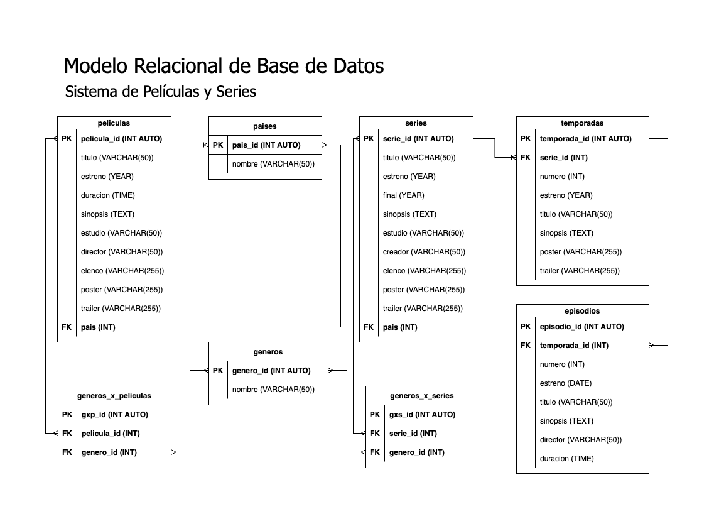

# PeliSeries

<!-- https://www.imdb.com/search/title/?genres -->

## Listado de Entidades

### peliculas **(ED)**

- pelicula_id **(PK)**
- titulo
- estreno
- duracion
- sinopsis
- estudio
- director
- elenco
- poster
- trailer
- pais **(FK)**

### series **(ED)**

- serie_id **(PK)**
- titulo
- estreno
- final
- sinopsis
- estudio
- creador
- elenco
- poster
- trailer
- pais **(FK)**

### temporadas **(ED)**

- temporada_id **(PK)**
- serie_id **(FK)**
- numero
- estreno
- titulo
- sinopsis
- poster
- trailer

### episodios **(ED)**

- episodio_id **(PK)**
- temporada_id **(FK)**
- numero
- estreno
- titulo
- sinopsis
- director
- duracion

### paises **(EC)**

- pais_id **(PK)**
- nombre

### generos **(EC)**

- genero_id **(PK)**
- nombre

### generos_x_peliculas **(EP)**

- gxp_id **(PK)**
- pelicula_id **(FK)**
- genero_id **(FK)**

### generos_x_series **(EP)**

- gxs_id **(PK)**
- serie_id **(FK)**
- genero_id **(FK)**

## Relaciones

1. Una **pelicula** tiene **país** (_1 - M_).
1. Una **serie** tiene **país** (_1 - M_).
1. Una **temporada** pertenece a **serie** (_1 - M_).
1. Un **episodio** pertenece a **temporada** (_1 - M_).
1. **Películas** pertenecen a **géneros** (_M - M_).
1. **Series** pertenecen a **géneros** (_M - M_).

## Diagramas

### Modelo Relacional de la BD

## Reglas de Negocio

### peliculas

1. Crear una película.
1. Leer todas las películas.
1. Leer una película en particular.
1. Actualizar una película.
1. Eliminar una película.

### series

1. Crear una serie.
1. Leer todas las series.
1. Leer una serie en particular.
1. Leer las temporadas de una serie.
1. Leer los episodios de una serie.
1. Actualizar una serie.
1. Eliminar una serie.

### temporadas

1. Crear una temporada.
1. Leer todas las temporadas.
1. Leer una temporada en particular.
1. Leer los episodios de una temporada.
1. Actualizar una temporada.
1. Eliminar una temporada.

### episodios

1. Crear un episodio.
1. Leer todos los episodios.
1. Leer un episodio en particular.
1. Actualizar un episodio.
1. Eliminar un episodio.

### paises

1. Crear un pais.
1. Leer todos los paises.
1. Leer un país en particular.
1. Actualizar un país.
1. Eliminar un país.

### generos

1. Crear un género.
1. Leer todos los géneros.
1. Leer un género en particular.
1. Actualizar un género.
1. Eliminar un género.

### generos_x_peliculas

1. Crear un gxp.
1. Leer los géneros de una película.
1. Eliminar un gxp.

### generos_x_series

1. Crear un gxs.
1. Leer los géneros de una serie.
1. Eliminar un gxs.
